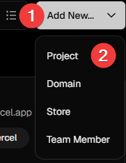
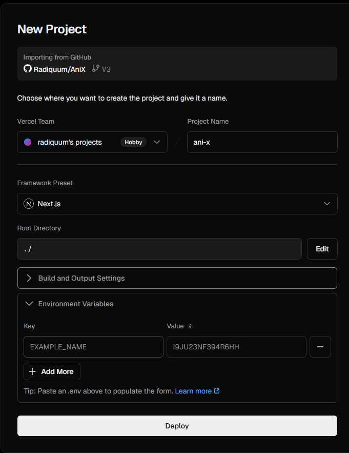
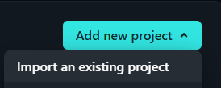
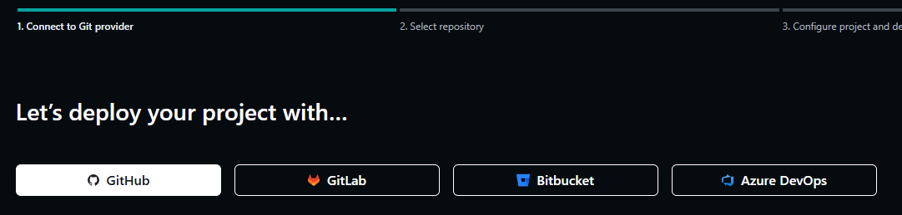
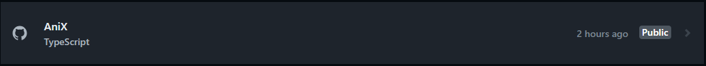
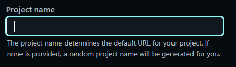
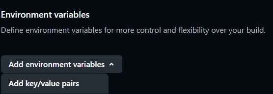
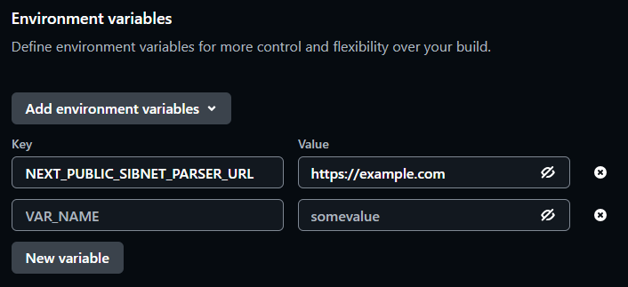
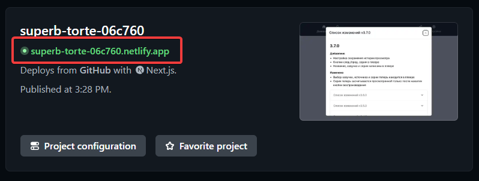

# AniX Application Deployment

## Vercel

Requirements:

- GitHub account
- Vercel account

1. Fork the repository

    

2. Log in to your Vercel account

> [!IMPORTANT]
> Your Vercel account must be linked with your GitHub account.
>
> If you don't have a Vercel account, create one by signing in with GitHub.

3. Click the button to create a new project

    

4. Click the import button next to the repository name

    

5. (optional) Add variable to use your own player and/or api-proxy:

   - NEXT_PUBLIC_PLAYER_PARSER_URL
   - NEXT_PUBLIC_API_URL

    Use the ones you received if you deployed [anix-player-parser](./player-parser/README.md) and/or [anix-api-prox](./api-prox/README.md)

    

6. Click the "Deploy" button and wait until you see a confirmation
7. Click the "Continue to Dashboard" button
8. The client will be available at a link of this form, click it to open
    

## Netlify

Requirements:

- GitHub account
- Netlify account

1. Fork the repository

    

2. Log in to your Netlify account

> [!IMPORTANT]
> Your Netlify account must be linked with your GitHub account.
>
> If you don't have a Netlify account, create one by signing in with GitHub.

3. Click the button to create a new project

    

4. Click the GitHub button

    

5. Click the repository name

    

6. (optional) Fill in the project name

    

7. (optional) Add variables to use your own player and/or api-proxy:

   - NEXT_PUBLIC_PLAYER_PARSER_URL
   - NEXT_PUBLIC_API_URL

    Use the ones you received if you deployed [anix-player-parser](./player-parser/README.md) and/or [anix-api-prox](./api-prox/README.md)

    1. 

    2. 

8. Click the "Deploy" button and wait until you see a confirmation

9. The client will be available at a link of this form, click it to open

    

## Docker

Requirements:

- [docker](https://docs.docker.com/engine/install/)

### Pre-built

1. Run the command:

`docker run -d --name anix -p 3000:3000 radiquum/anix:latest`

### Manual build

Additional Requirements:

- [git](https://git-scm.com/)

1. Clone the repository `git clone https://github.com/Radiquum/AniX`
2. Navigate to the repository directory `cd AniX`
3. Run the command `docker build -t anix .`
4. Once finished, run the command: `docker run -d --restart always --name anix -p 3000:3000 anix`

### docker/Flags

- -d - run container in the background
- --restart always - always restart after server reboot
- --name - container name
- -p - container port to be exposed externally. PORT:3000

> [!NOTE]
> For variables you received if you deployed [anix-player-parser](./player-parser/README.md) and/or [anix-api-prox](./api-prox/README.md), you need to use `-e VARIABLE=VALUE` before the last word anix

[docker run command](https://docs.docker.com/reference/cli/docker/container/run/)

### docker/After deployment

The service will be available at: `http://<YOUR IP><:YOUR PORT>/`

### docker/Note

To use your own domain and support HTTPS protocol, you can use Traefik or another reverse proxy with SSL certificate.

Useful links:

- [Converter from docker run command to docker compose syntax](https://it-tools.tech/docker-run-to-docker-compose-converter)
- [How to setup Traefik + custom domain + SSL](https://letmegooglethat.com/?q=how+to+setup+traefik+with+custom+domain+and+ssl+certificate+from+lets+encrypt%3F)

## pm2

Requirements:

- [git](https://git-scm.com/)
- [nodejs 23+ with npm](http://nodejs.org/)
- [pm2](https://pm2.keymetrics.io/)

Instructions:

1. Clone the repository `git clone https://github.com/Radiquum/AniX`
2. Navigate to the repository directory `cd AniX`
3. Run the command `npm install`
4. (optional) copy `.env.sample` as `.env` and fill it with variables you received if you deployed [anix-player-parser](./player-parser/README.md) and/or [anix-api-prox](./api-prox/README.md)
5. Run the command `npm run build`
6. Create a new directory (next we will be refer to its name as `<new_dir>`)
7. Move the following files into the new directory (`<new_dir>`):
    - move `public` directory to `<new_dir>/public`
    - move `.next/static` directory to `<new_dir>/.next/static`
    - move files from `.next/standalone` to `<new_dir>`
8. Move into the created directory (<new_dir>) and run the command `pm2 start server.js -n anix`

### pm2/Flags

- -n - service name in pm2

### pm2/After deployment

The service will be available at: `http://<YOUR IP>:3000/`

### pm2/Note

To enable automatic application startup, it is recommended to configure pm2 to start on boot using the command: `pm2 startup`

Useful links:

- [PM2: managing processes smartly @ Habr](https://habr.com/ru/articles/480670/)
