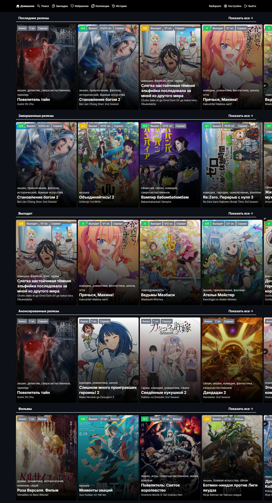
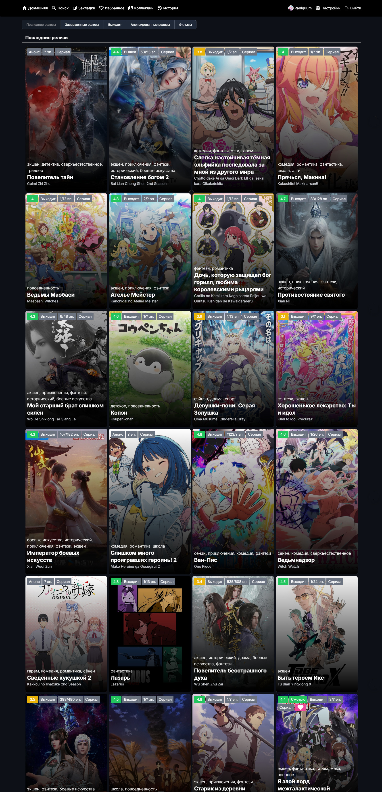
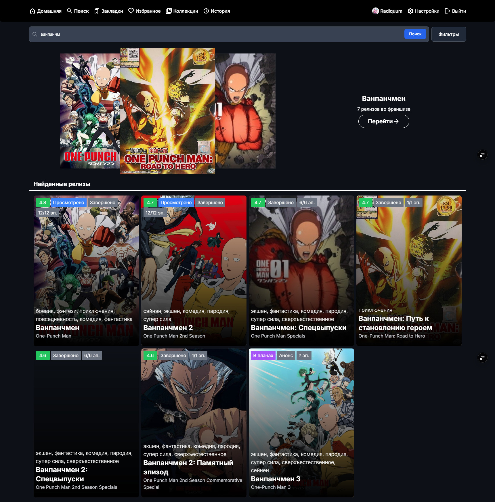
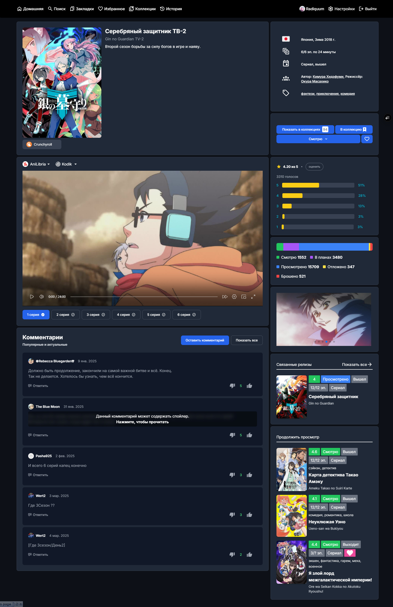

# AniX - Unofficial Web Client for Anixart

AniX is an unofficial web client for the Android application Anixart. It allows you to access and manage your Anixart account from a web browser on your desktop or laptop computer.

## Disclaimer

Please note that AniX is an unofficial project and is not affiliated with the developers of Anixart. It is recommended to use the official Anixart app for the most up-to-date features and functionality.

---

[[RU] ПРОЧТИ МЕНЯ](./README.RU.md) | [[EN] README](./README.md)

[[RU] РАЗВЁРТЫВАНИЕ](./DEPLOYMENT.RU.md) | [[EN] DEPLOY](./DEPLOYMENT.md)

[[RU] Changelogs](./public/changelog)

---

## Screenshots

Pages Short

Pages Full

Search Page

Release Page

User Page

## Contributing

We welcome contributions to this project! If you have any bug fixes, improvements, or new features, please feel free to create a pull request.
