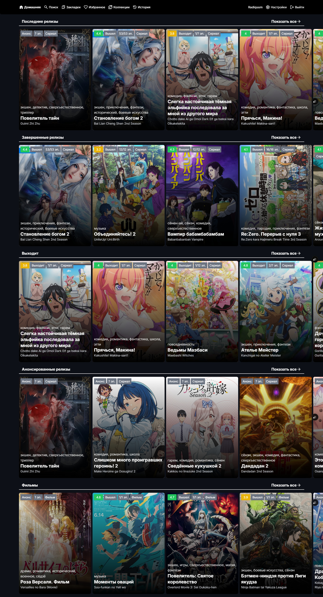
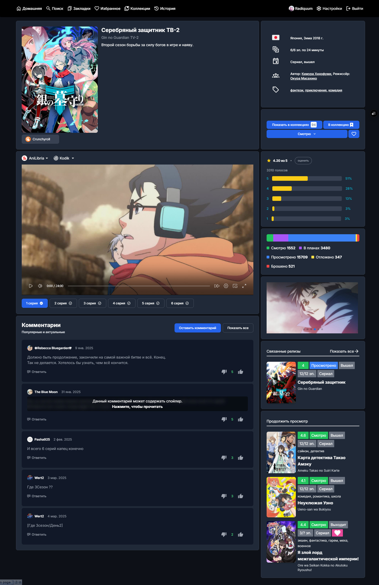

# AniXDesktop

AniXDesktop is an unofficial web client for AniXart, built as a cross-platform desktop application using Electron and Next.js.

---

## Features

- Manage your AniXart account from your desktop or laptop computer
- Modern, fast UI
- Multi-language support

---

## Getting Started

### Prerequisites

- Node.js (version 23+ recommended)
- npm or yarn
- [Electron](https://www.electronjs.org/)
- [Electron Builder](https://www.electron.build/)

### Installation

1. Clone the repository:
   ```sh
   git clone https://github.com/LorendosCSharp/AniXDesktop.git
   cd AniXDesktop
   ```

2. Install dependencies:
   ```sh
   npm install
   ```
---

## Development

To run the project in development mode:

```sh
npm run dev
```

To lint the code:

```sh
npm run lint
```

---

## Building the Electron App

### 1. Build the Next.js app

```sh
npm run build
```

### 2. Patch flowbite-react (postinstall script runs automatically after install)

If you need to run it manually:
```sh
npm run postinstall
```

### 3. Run the Electron app

```sh
npm run electron
```

### 4. Package the Electron app for distribution

```sh
npm run dist
```

> **Recommended workflow for Electron app:**  
> `install` → `build` → `dist`

---

## Scripts

```json
"scripts": {
  "dev": "next dev",
  "build": "next build",
  "start": "next start",
  "lint": "next lint",
  "postinstall": "flowbite-react patch",
  "electron": "electron main.js",
  "dist": "electron-builder"
}
```

---

## Contributing

We welcome contributions to this project!  
If you have bug fixes, improvements, or new features, please open a pull request.

---

## License

This project is unofficial and unaffiliated with AniXart.

---
## Screenshots

<details>
<summary>Pages Short</summary>



</details>

<details>
<summary>Pages Full</summary>


</details>

<details>
<summary>Search Page</summary>


</details>

<details>
<summary>Release Page</summary>



</details>

<details>
<summary>User Page</summary>


</details>

---

## Contact

For questions or support, please open an issue in this repository.
